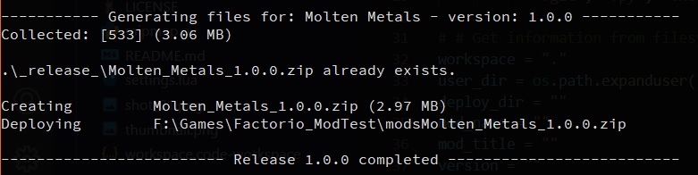
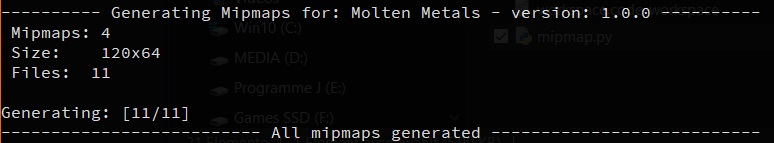

# A small tool collection for Factorio Modding

All Python scripts are written under 3.9.3 so you need at least 3.6 (if i remember correctly)
If you have any suggestion then please let me know.

---

## deploy.py

A small script to help zip and copy your mod.



### The default folder structure is like:

Your_Mod  
|- \_release_ (youll find your zip files here)  
|- all   
|- other  
'- folders (like graphics, locale, etc)


There are some settings on top of the file like paths and exclude.
Excluding files and folders goes by name and are read as literals so a dot is just a dot.  
This means, you should be as exact as possible. So look into your zip and check just to be shure ;)

Mod-version and name are read from the info.json file.  

### Arguments:
|Arg|Name|Default|Description|
|-:|:-:|:-:|:-|
|*-h*|help||Prints a short usage and description of all available arguments.|
|*-v*|verbose|False|Shows some additional informations like the filenames and paths. It the also asks you if an existing zip should be overwritten or not (default False)|
|*-d*|deploy|True|Wether or not to deploy (copy to Factorio/mods/) or not. In both cases a zip is generated and copied to \_release_ (default True)

### Usage:  
```
C:\Path\To\Mod_Name> python deploy.py
```
or  
```
PS C:\Path\To\Mod_Name> .\deploy.py
```
Note: the ``.\`` method shows no output as it will launch another terminal instance and close it afterwards.

---

## mipmap.py

Generates mipmaps from png



Have a look at the presets section in the file to change like the in/out folders.  
It can read the info.json but will work in any folder.

### Arguments:
|Arg|Name|Default|Description|
|-:|:-:|:-:|:-|
|*-h*|help||Prints a short usage and description of all available arguments.|
|*-v*|verbose|False|shows every processed file|
|*-c*|crop|False|crop the canvas|
|*-s*|set icon size|64|set icon size to the specified size (min 32)|
|*-m*|set mipamp amount|4|set mipamp amount to the specified amount|
|*-i --in*|input folder|graphics/\_single/|set the ouput folder|
|*-o --out*|output folder|graphics/\_multi/|set the input folder|

### Usage:  
```
C:\Path\To\Mod_Name> python mipmap.py
```
or  
```
PS C:\Path\To\Mod_Name> .\mipmap.py
```
Note: the ``.\`` method shows no output as it will launch another terminal instance and close it afterwards.

